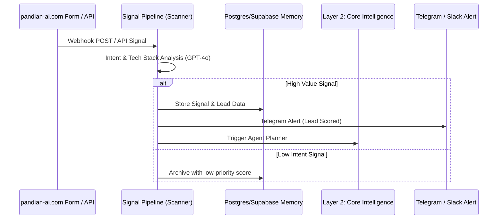

# 📡 Layer 1: Perception (Ingestion)

The Perception Layer acts as the "sensory system" of the architecture. It is responsible for ingesting signals from external sources, performing initial processing/intent-classification, and queuing tasks or triggering alerting workflows.

---

## 🗺️ Ingestion Flow Diagram

---

## 🛠️ Components & Architecture

### 1. `pandian-ai.com` Native Intake
* **Description**: A modern, glassmorphism-styled React/Vite web application that acts as the primary public-facing portal.
* **Functionality**:
  * Captures 10 structured fields from prospects (e.g., tech stack, budget, goals).
  * Submits via a secure `POST` webhook to n8n.
  * Connects to Telegram alerts for immediate notifications.

### 2. Signal Pipeline
* **Scanner (`Scanner.json`)**:
  * Periodically scans market signals, jobs boards, or webhooks.
  * Employs GPT-4o to analyze company descriptions, detecting their tech stack and intent (e.g., hiring AI developers, scaling database architecture).
* **Feedback Analyzer (`Feedback-Analyzer.json`)**:
  * Scans user feedback and client replies to gauge sentiment.
  * Segregates signals into actionable feedback lists or cold blacklists.
* **Error Alert (`Error-Alert.json`)**:
  * Captures any runtime errors during ingestion and routes formatted telemetry to Telegram.

### 3. AI Lead Gen Machine
This is a three-workflow suite implementing cold outreach, reply monitoring, and follow-ups.
* **Campaign A: Main Campaign (`A_Main_Campaign`)**:
  * Ingests scraped leads, performs lead scoring, and uses AI to generate custom emails.
  * Outboxes emails via SMTP with high-deliverability settings.
* **Campaign B: Reply + Bounce Handler (`B_Reply_Handler`)**:
  * Periodically scans the inbox via IMAP.
  * Classifies replies as *Hot Lead*, *OOO*, *Not Interested*, or *Unsubscribe*.
  * Updates Supabase state and logs bounces.
* **Campaign C: Breakup Sequence (`C_Breakup_Sequence`)**:
  * Manages follow-ups and final "breakup" outreach if no response is detected.
  * Enforces the blacklist suppression gate to prevent spamming.

---

## 🛡️ Ingestion Security & Filtering
1. **Blacklist Suppression Gate**: Before any outreach email is dispatched, a JavaScript filter checks the recipient against the `blacklist` database table. If a match is found, the sequence halts immediately.
2. **Global SAFE_MODE Guard**: When `SAFE_MODE=true` is set in the environment, all outbound SMTP calls are bypassed, writing simulated logs instead to allow risk-free system testing.
