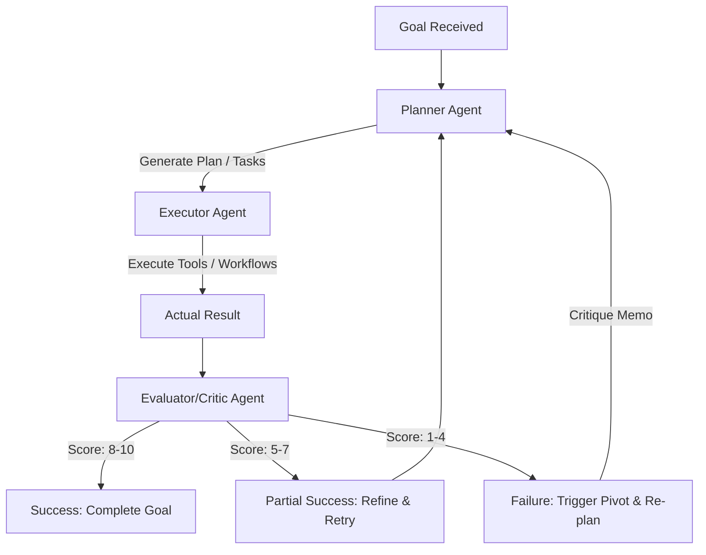

# 🧠 Layer 2: Core Intelligence (Agentic Loop)

The Core Intelligence Layer acts as the "brain" of the enterprise architecture. It handles reasoning, goal decomposition, tool execution, and quality evaluation. Instead of simple linear flows, it relies on a **Planner-Critic loop** that enables the system to autonomously pivot when failures are encountered.

---

## 🔁 The Planner-Critic Agentic Loop

---

## 🤖 Claude MCP Task Orchestrator (v2.0)

The core engine is a **Node.js-based Model Context Protocol (MCP) Server** that bridges Claude Desktop directly with your development environment and database layers.

### Key Engineering Patterns:
1. **Zod Validation Schema**: Tools are strictly typed and validated using `Zod` schemas. If Claude attempts to send ill-formed inputs, the request fails fast with standard JSON-RPC codes (e.g., `-32602: Invalid params`).
2. **PostgreSQL / Supabase Integration**: Migrated from Google Sheets to database tables (`tasks` and `standup_log`) to enable concurrent read-locks, transactional integrity, and aggregations.
3. **Idempotency Guard**: Writes are protected by a SHA-256 payload hash with a 5-second deduplication window. This ensures LLM retry loops do not produce duplicate tasks or writes.
4. **Structured Logging**: Tool executions log request IDs, duration in milliseconds, and status to `stderr` in JSON format for distributed tracing.

---

## ✍️ Prompt Library

The orchestration loop relies on strict separation of concerns between two primary system prompts:

### 1. The Planner (`planner_system.txt`)
* **Role**: Goal decomposition, task graph generation, and planning.
* **Logic**: Breaking down user goals into discrete database tasks.
* **Strict Control**: Does not evaluate its own output; it only generates instructions and processes Critique Memos.

### 2. The Evaluator / Critic (`evaluator_system.txt`)
* **Role**: Quality assurance and pivot decision-making.
* **Logic**: Compares "Expected Output" vs. "Actual Result" from tools.
* **Scoring Rubric**:
  * **8-10**: Success. Proceed to next task.
  * **5-7**: Partial Success. Refine instructions.
  * **1-4**: Failure. Logs a Critique Memo and triggers a **system pivot**.

---

## 🔎 The Agent Decision Trace: "Proof of Cognition"

Located at `docs/AGENT_DECISION_TRACE.json`, this trace is critical evidence of L4 Autonomy. 

### What it proves:
1. **Error Detection**: The AI intercepts a runtime tool failure (e.g., API rate-limiting or network timeout).
2. **Self-Critique**: The Critic analyzes the log, identifies the bottleneck, and outputs a critique memo outlining why the current approach failed.
3. **Autonomous Pivot**: The Planner consumes the critique and modifies the execution graph (e.g., switching to an alternative API or lowering throughput) without human intervention.
