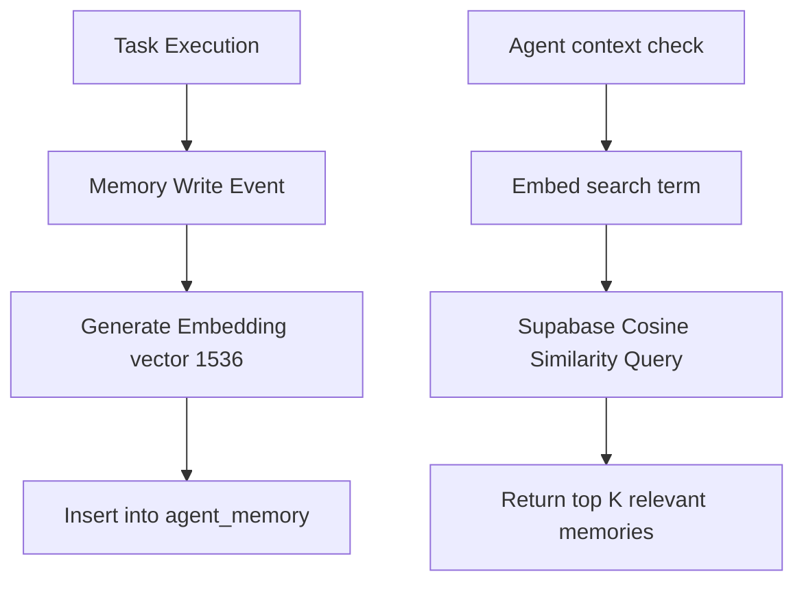

# 💾 Layer 3: Memory & State (Supabase / Postgres)

Layer 3 provides statefulness and continuity to the autonomous systems. It is split into two parts: **Structured Relational State** (for tracking tasks, leads, and runs) and **Semantic Memory** (for contextual search and agent recall over long periods).

---

## 💾 Relational & Vector DB Schema

The database is built on **PostgreSQL (Supabase)** and leverages the `pgvector` extension for semantic embeddings.

### 1. Leads & Prospect Data (`leads` table)
* Tracks ingested signals, buyer persona classification, and intent scoring.
* **Fields**: `id` (UUID), `email` (Text, Unique), `company_name` (Text), `intent_score` (Integer), `buying_signals` (JSONB), `created_at` (Timestamp).

### 2. Agent Execution Tracking (`agent_tasks` table)
* Serves as the Control Plane for Layer 2. Allows agents to query their task list and update execution statuses.
* **Fields**: `id` (UUID), `plan_id` (UUID), `action_name` (Text), `status` (`pending`, `running`, `success`, `failed`, `pivoted`), `payload` (JSONB), `result` (JSONB), `retry_count` (Integer).

### 3. Semantic Memory (`agent_memory` table)
* Holds long-term episodic memory. When agents perform operations, summaries are embedded and stored here.
* **Fields**: `id` (UUID), `content` (Text), `embedding` (`VECTOR(1536)` - optimized for OpenAI/Gemini embeddings), `metadata` (JSONB), `importance_score` (Float).

### 4. Centralized Observability (`execution_logs` table)
* The audit trail for all system components. Ingested via the Log-Drain.
* **Fields**: `id` (UUID), `workflow_name` (Text), `tool_name` (Text), `level` (`debug`, `info`, `warn`, `error`), `message` (Text), `metadata` (JSONB), `session_id` (Text).

---

## 🧠 Infinite Memory Vault

The **Infinite Memory Vault** (`Infinite-Memory-Vault/Vault.json`) is a high-reliability n8n workflow that manages reads and writes to the `agent_memory` vector store.

### Key Technical Aspects:
* **Cosine Similarity**: Utilizes pgvector's operator `<->` (Euclidean distance) or `<=>` (Cosine distance) to retrieve semantic contexts within 100ms.
* **Episodic Recall**: Enables an outreach agent or proposal writer to remember previous sessions with a client, past objections, or the user's business goals without needing massive system prompt contexts.

---

## 📊 Centralized Log-Drain Observability

To avoid logging fragmentation across 14 workflows, the **Centralized Log-Drain** ingestion flow (`log-drain-production.json`) serves as a unified logging pipeline.

### Pipeline Flow:
1. **Log Ingestion**: Any workflow experiencing errors or completing milestones makes an HTTP POST request containing structured log data to the `/log-drain` webhook.
2. **Filtering**: The `IF: Is Critical?` node matches if the log level is `ERROR` or `CRITICAL`.
3. **Alerting**: 
   * If **Critical**: Immediately sends a formatted Telegram markdown alert containing the error trace and correlation ID directly to the operations channel.
   * In parallel, inserts the trace into the PostgreSQL `execution_logs` table.
   * If **Info/Debug**: Natively writes to `execution_logs` without triggering alerts.
