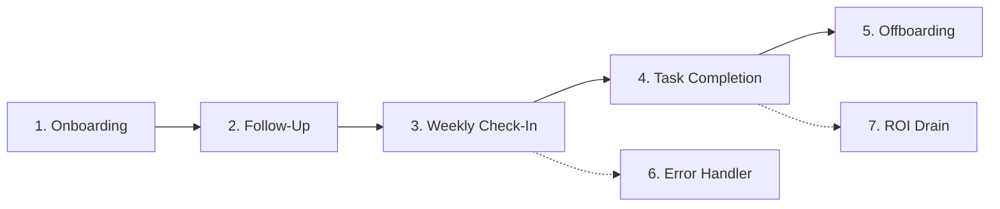

# ⚙️ Layer 4: Execution Engines (Workflows & Solutions)

The Execution Layer contains the domain-specific automated workflows and agents. They represent the "muscles" of the system, doing the real work under the planning guidance of Layer 2 and loading state from Layer 3.

---

## 🏗️ Execution Architecture Matrix

| Solution | Trigger | Major Nodes / Nodes Count | Outputs / Actions | Autonomy |
| :--- | :--- | :--- | :--- | :--- |
| **Gold Standard Agency OS** | Webhook / Scheduler | 7 Workflows (Modular) | End-to-end client management + ROI logging | L4 (Adaptive) |
| **Invoice Vision Auditor** | File Upload / Email | 3 Workflows, 60+ Nodes | Line-item extraction, tax matching, DB write | L3 (Conditional) |
| **Content Alchemist** | Voice Memo | Webhook to Whisper | Social media copies, blog draft, visual prompt | L3 (Conditional) |
| **Auto-Blogger SEO Suite** | Topic Scheduler | Google Search + GPT-4o | Fully formatted articles pushed to WordPress | L3 (Conditional) |
| **AI Influencer Factory** | Form / Schedule | Ideogram API + Meta API | Image assets generation & automated posting | L3 (Conditional) |
| **WhatsApp AI Bot Series** | Inbound Message | Twilio + vector lookup | RAG customer service responses | L3 (Conditional) |

---

## 🛠️ Deep Dive: Core Engines

### 1. Flagship: v7.6 Gold Standard Modular Suite
Located at `Week_10_Gold_Standard_Suite/`, this is a 7-engine automated lifecycle suite designed for professional agencies.

* **Onboarding**: Ingests client data, spins up projects, creates folders, and initiates welcome campaigns.
* **Follow-Up**: Periodically prompts the client for materials or reviews.
* **Weekly Check-In**: Runs aggregate reports on task boards and drafts human-like status summaries.
* **Completion**: Packages project files and emails deliverables.
* **Offboarding**: revokes access, archives assets, and generates the final recap.
* **ROI-Drain**: Automatically calculates human labor hours saved and records metrics into Supabase to justify system costs.

### 2. Invoice Vision Auditor
A 3-workflow, 60+ node automated system for receipt and invoice processing.
* **Image Processing**: Integrates with GPT-4o Vision to audit physical receipts and digital PDFs.
* **Extraction**: Obtains line-item billing data, taxes, currencies, and invoice numbers.
* **Cross-Validation**: Queries past purchase orders to ensure there are no double payments before committing records to Supabase.

### 3. Content Alchemist & Auto-Blogger
* **Voice-to-Text Ingestion**: Converts audio files (WhatsApp PTT or uploading files) into clean transcripts using OpenAI Whisper.
* **Repurposing**: Generates multi-platform posts (LinkedIn, X, Threads) and schedules them.
* **Auto-Blogger**: Integrates directly with the WordPress REST API, incorporating a WordPress publisher safety gate to inspect drafts before publishing them live.
