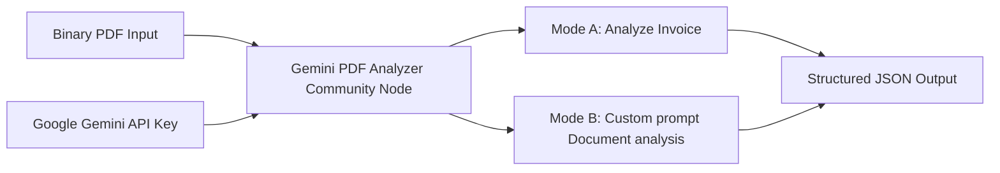

# 🔌 Layer 5: Extensions (Custom Nodes & MCP Servers)

Layer 5 handles custom developer extensions that extend the base functionality of n8n and AI agents. It consists of custom-built n8n community nodes and Model Context Protocol (MCP) servers.

---

## 📦 Custom Community Node: `n8n-nodes-gemini-pdf-analyzer`
Located in `layer-5-extensions/n8n-nodes-gemini-pdf-analyzer/`, this is a published TypeScript n8n community node available on [npm](https://www.npmjs.com/package/n8n-nodes-gemini-pdf-analyzer).



### Key Capabilities:
* **Invoice Analysis Mode**: Uses Gemini's multimodal capabilities to analyze invoices and automatically extract vendor details, invoice numbers, total amounts, date, signature presence, validity, and check for compliance warnings.
* **Document Custom Mode**: Allows custom text prompts to be executed against any PDF document to extract structured JSON based on user requirements.
* **Robust Output Structure**: Emits clean, well-formatted JSON with zero regex parsing required in subsequent n8n nodes.

---

## 🔧 Installation & Local Setup

### 1. Production Installation via n8n UI
1. Navigate to **Settings → Community Nodes → Install**.
2. Search for: `n8n-nodes-gemini-pdf-analyzer`.
3. Click **Install**.

### 2. Manual Development & Local Linking
To modify the node and test locally:
```bash
# Clone the repository
git clone https://github.com/kspandian32-sudo/Enterprise-n8n-Architectures.git
cd Enterprise-n8n-Architectures/layer-5-extensions/n8n-nodes-gemini-pdf-analyzer

# Install dependencies and build typescript code
npm install
npm run build

# Link the node locally
npm link
# Navigate to your local n8n installation directory and run:
npm link n8n-nodes-gemini-pdf-analyzer
```

---

## 🤖 Model Context Protocol (MCP) Servers
The stack also uses custom MCP servers (like the `Claude-MCP-Task-Orchestrator` detailed in Layer 2) to bridge LLMs with operational tools.

* **Task Management**: Bridges SQLite/PostgreSQL task schemas with Claude's function call layer.
* **System Operations**: Standardized execution interfaces that return structured JSON-RPC responses.
