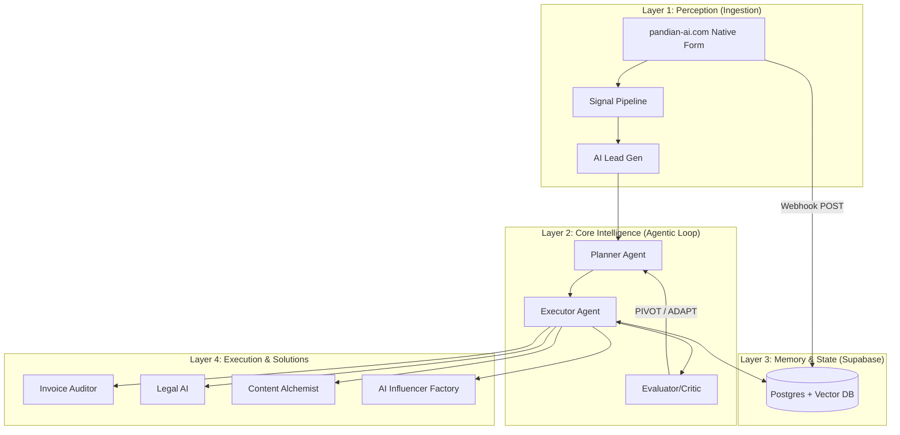

# 📖 Enterprise n8n Architectures - Code Wiki

Welcome to the official, locally-generated **Code Wiki** for the `Enterprise-n8n-Architectures` repository. This wiki contains deep architectural breakdowns, logic flows, database designs, and implementation details for the L4 Autonomous AI Agents and workflows.

---

## 🗺️ System Overview

The project is structured around a **5-Layer Compound AI Architecture**. This design separates perception (sensing/ingestion) from intelligence (planning/critiquing), state (memory/persistence), and execution (solving specific tasks).



---

## 📂 Wiki Navigation Hub

Select a layer or strategy below to view detailed code-level documentation, schemas, and operational instructions:

### 📡 [Layer 1: Perception Layer](./Layer_1_Perception.md)
*Contains documentation on the ingestion signals, Vite intake form, intent classification, and SMTP lead generation machine.*

### 🧠 [Layer 2: Core Intelligence](./Layer_2_Core.md)
*Explains the Planner-Evaluator agentic loop, Claude MCP Orchestrator, Zod-based JSON-RPC schema contracts, and the Agent Decision Trace.*

### 💾 [Layer 3: Memory & State](./Layer_3_Memory.md)
*Details the Supabase pgvector configuration, database relational schema, unified Log-Drain observability, and postgres state tracking.*

### ⚙️ [Layer 4: Execution Engines](./Layer_4_Execution.md)
*Deconstructs the 11 modular execution workflows, including the Gold Standard Agency OS, Invoice Vision Auditor, Legal AI, and Content Alchemist.*

### 🔌 [Layer 5: Extensions](./Layer_5_Extensions.md)
*Describes the custom community typescript nodes (Gemini PDF Analyzer) and external Model Context Protocol (MCP) servers.*

### 🛡️ [Resilience, SAFE_MODE, & Scaling](./Resilience_and_Scaling.md)
*Covers the Global SAFE_MODE dry-run harness, advanced error handling, Redis-based horizontal scaling, and Queue-Mode deployment.*

---

## 🚀 How to Use this Wiki on GitHub
1. **Inside the Repository**: You can keep this `wiki/` directory directly inside your codebase. GitHub will render these Markdown pages natively with working links.
2. **GitHub Wiki Integration**: If you wish to use GitHub's dedicated **Wiki** tab, clone your repository's wiki:
   ```bash
   git clone https://github.com/kspandian32-sudo/Enterprise-n8n-Architectures.wiki.git
   ```
   Copy all files from this `wiki/` directory into that cloned repository, then commit and push. They will instantly appear on your GitHub Wiki page.
