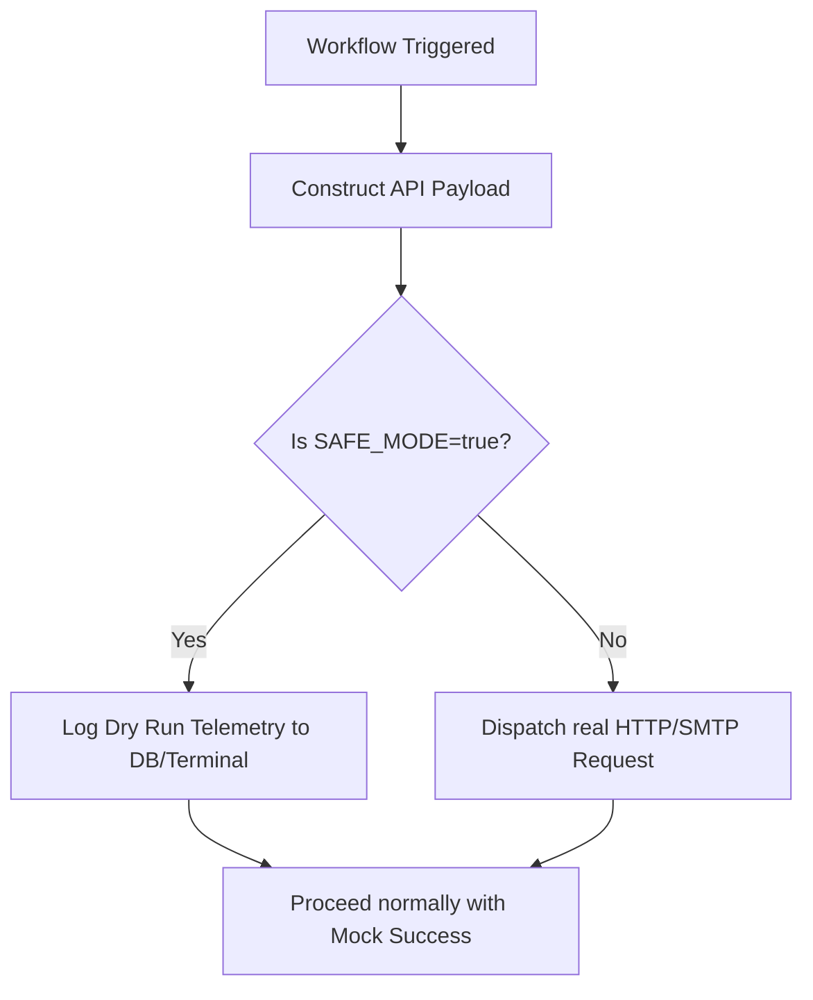

# 🛡️ Resilience, SAFE_MODE, & Scaling

This document details the architectural strategies used to ensure that these autonomous AI systems are resilient enough to run in production without high maintenance overhead or accidental real-world side effects.

---

## 🛡️ Global SAFE_MODE Harness

To allow safe testing of complex agent behaviors (such as sending emails, posting to social media, or running invoices) directly in development environments, we implement a **Global SAFE_MODE Toggle**.



### Affected Sub-Systems:
* **AI Lead Gen Machine**: Gates actual SMTP email outboxes.
* **Auto-Blogger**: Gates the WordPress publishing REST endpoint.
* **AI Influencer Factory**: Gates Ideogram image generation API and Instagram publisher.
* **Invoice Vision Auditor**: Gates final file movement and DB commit modifications.
* **AI Onboarding Machine**: Gates Gmail outreach and Salesforce/CRM write operations.

### Technical Implementation:
We leverage standard `n8n` IF nodes checking the system environment variable:
* In `n8n.env` or system variables, `SAFE_MODE=true` routes requests through Mock nodes.
* This is extremely cost-effective as it prevents consuming paid API tokens during testing.

---

## 🚨 Advanced Error Recovery

AI operations can fail due to API rate limits, schema changes, or LLM hallucination. The architecture deploys three recovery patterns:

1. **Exponential Backoff**: n8n HTTP Request nodes are configured to retry up to 3 times, scaling delays dynamically (e.g., retry 1 after 1m, retry 2 after 5m, retry 3 after 15m) to handle transient network outages.
2. **Dead Letter Queues (DLQ)**: Tasks that fail permanently are not discarded. They are routed to a Postgres-backed DLQ table, triggering a Telegram alert for manual developer triage.
3. **Self-Healing Agent Loops**: In Layer 2, the **Evaluator Critic** can identify if a plan has stalled (e.g. repeated failures of the same task) and instruct the **Planner** to change credentials, parameters, or switch to backup engines.

---

## 🏗️ Production Scaling & Queue-Mode

For horizontal scaling in enterprise deployments, the system is optimized for **n8n Queue Mode** using Docker Compose.

```
┌─────────────┐    ┌──────────────┐    ┌──────────────┐
│  n8n Main    │    │ n8n Webhook  │    │ n8n Worker   │
│ (Editor/API) │    │ (Inbound HTTP)│   │ (Execution)  │
│  2CPU / 4GB  │    │  1CPU / 2GB  │    │  4CPU / 8GB  │
└──────┬───────┘    └──────┬───────┘    └──────┬───────┘
       │                   │                   │
       └───────────┬───────┴───────────────────┘
                    │
          ┌─────────┴──────────┐
          │                    │
     ┌────┴─────┐    ┌────────┴────────┐
     │ PostgreSQL│    │  Redis (Queue)  │
     │ 2CPU/4GB │    │  1CPU / 1GB     │
     └──────────┘    └─────────────────┘
```

* **Redis & BullMQ**: Used to manage execution jobs and distribute tasks to n8n workers.
* **Stateless Workers**: All state resides in PostgreSQL (Supabase) and Redis, allowing you to spin up or down workers dynamically based on load:
  ```bash
  docker compose -f docker-compose.production.yml up -d --scale n8n-worker=4
  ```
