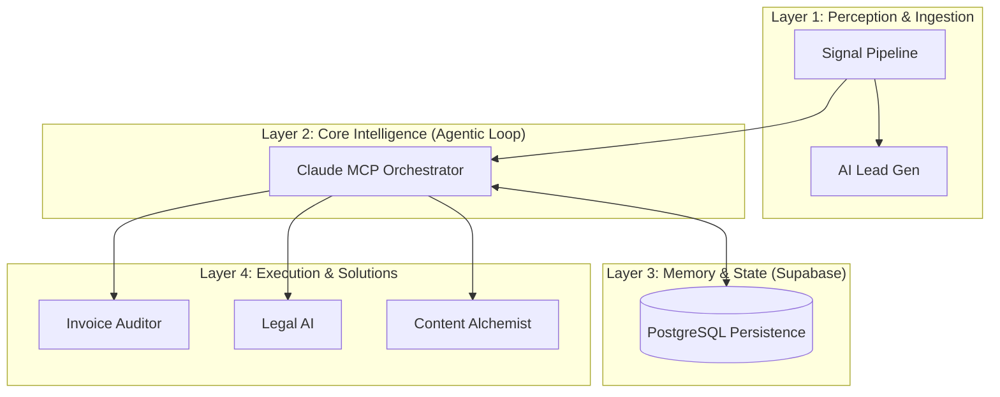

# Enterprise n8n Architectures

[](https://www.npmjs.com/package/n8n-nodes-gemini-pdf-analyzer)
[](https://opensource.org/licenses/MIT)
[](./docs/AUDIT_EVOLUTION.md)

A curated collection of **14 production-grade** n8n workflows and autonomous AI agents, structured into an enterprise-grade layered architecture.

> [!NOTE]
> **Post-Audit Evolution:** Following a 5.5/10 audit by senior AI architects, this repository was fully refactored to implement **PostgreSQL persistence**, **Custom TypeScript Nodes**, and **Autonomous Feedback Loops**. See the [Audit Evolution Scorecard](./docs/AUDIT_EVOLUTION.md) for details.

---

## 🗺️ System Architecture



---

## 🚀 The Layered Stack

### 📂 [Layer 1: Perception](./layer-1-perception/)
*   **Signal Pipeline:** Autonomous job/market signal ingestion.
*   **AI Lead Gen:** Targeted prospect identification with AI scoring.

### 📂 [Layer 2: Core Intelligence](./layer-2-core/)
*   **Claude MCP Orchestrator:** The central brain using JSON-RPC to manage planning, execution, and critique.

### 📂 [Layer 3: Memory](./layer-3-memory/)
*   **Infinite Memory Vault:** Long-term episodic memory powered by Supabase/pgvector.

### 📂 [Layer 4: Execution](./layer-4-execution/)
*   **Invoice Auditor:** Multi-modal PDF extraction and validation.
*   **Enterprise Sales Rep:** Human-in-the-loop autonomous outreach.
*   **Local Legal AI:** Privacy-first legal document analysis.
*   **Content Alchemist:** Multi-channel content generation system.

### 📂 [Layer 5: Extensions](./layer-5-extensions/)
*   **Custom n8n Nodes:** Native TypeScript extensions for the n8n platform.


---

## 🛠️ Custom n8n Extensions
| Custom Node.js code | 1 MCP Server + 1 n8n Community Node | Advanced platform extensibility |
| Error handling sub-workflows | 3 dedicated error handlers | Production resilience pattern |
| Resilience Pattern | Global SAFE_MODE (4 major projects) | High-reliability test harness |
| Local AI infrastructure | 3 Modelfiles + 6 AnythingLLM workspaces | Hardware-aware optimization |
| Proof-of-work artifacts | Real-world execution logs & visual dashboards | Verifiable production metrics |


### 🛡️ Enterprise Resilience (SAFE_MODE)
This portfolio implements a **Global SAFE_MODE Toggle** across 4 major automation systems:
- **Lead Gen Machine**: Gates cold outreach / SMTP.
- **Invoice Vision Auditor**: Gates file movements / external API writes.
- **Signal Pipeline**: Gates email alerting / intent notifications.
- **Auto-Blogger**: Gates WordPress publishing API.

**Architecture:** Destructive actions are programmatically gated by environment-based IF branches (`SAFE_MODE=true`). This ensures that developers can run end-to-end tests without triggering real-world side effects. Designed for the n8n Community Edition by leveraging system environment variables instead of Enterprise-only UI features.

## 💰 Measured ROI (Representative)

| Project | Manual Process | Automated | Improvement |
|:---|:---|:---|:---|
| Invoice Vision Auditor | ~4 min/invoice (manual check + filing) | ~15 sec/invoice (end-to-end) | **16× speed, 0% miss rate** |
| AI Lead Gen Machine | ~30 min/lead (research + draft + send) | ~45 sec/lead (fully automated) | **40× throughput** |
| Content Alchemist | ~2 hrs/post (transcribe + write + design) | ~3 min/post (voice → published) | **40× faster, consistent quality** |
| Signal Pipeline | ~45 min/scan (manual job board review) | ~90 sec/scan (AI scored + deduped) | **30× speed, zero missed signals** |
| Auto-Blogger | ~3 hrs/article (research + write + publish) | ~2 min/article (prompt → WordPress) | **90× faster production** |

---

## 🏗️ Production Deployment

This repository includes a production-ready [docker-compose.production.yml](./docker-compose.production.yml) for enterprise deployment:

```
┌─────────────┐    ┌──────────────┐    ┌──────────────┐
│  n8n Main    │    │ n8n Webhook  │    │ n8n Worker   │
│ (Editor/API) │    │ (Inbound HTTP)│   │ (Execution)  │
│  2CPU / 4GB  │    │  1CPU / 2GB  │    │  4CPU / 8GB  │
└──────┬───────┘    └──────┬───────┘    └──────┬───────┘
       │                   │                   │
       └───────────┬───────┴───────────────────┘
                   │
         ┌─────────┴──────────┐
         │                    │
    ┌────┴─────┐    ┌────────┴────────┐
    │ PostgreSQL│    │  Redis (Queue)  │
    │ 2CPU/4GB │    │  1CPU / 1GB     │
    └──────────┘    └─────────────────┘
```

### Quick Start
```bash
# 1. Create environment file
cp .env.example .env
# Edit with your secrets: POSTGRES_PASSWORD, N8N_ENCRYPTION_KEY, JWT_SECRET

# 2. Deploy
docker compose -f docker-compose.production.yml up -d

# 3. Scale workers for higher throughput
docker compose -f docker-compose.production.yml up -d --scale n8n-worker=4
```

## 🔄 Data Layer Strategy

Google Sheets is used intentionally as a **zero-infrastructure bootstrap layer** — not a permanent architecture decision. See the [MIGRATION.md](./docs/MIGRATION.md) for the complete Sheets → PostgreSQL/Supabase migration guide with SQL schemas, n8n node swap instructions, and per-project priority assessment.

> **Note:** The [Infinite Memory Vault](./Infinite-Memory-Vault/) already runs on Supabase with pgvector, demonstrating the target migration pattern.

---

## ⚙️ Workflow Import Guide

1. **Import**: Import `.json` workflow files into your n8n instance.
2. **Configure Credentials**: Replace all `REPLACE_WITH_YOUR_CREDENTIAL_ID` placeholders.
3. **Configure Resources**: Replace `REPLACE_WITH_YOUR_SHEET_ID` and `REPLACE_WITH_DRIVE_FOLDER_ID`.
4. **Test**: Use `SAFE_MODE=true` to verify logic without side effects.
5. **Deploy**: Activate workflows and monitor via n8n's built-in execution log.

> **Security**: All credentials, API keys, emails, and personal identifiers have been removed. No production secrets exist in this repository's history.

---
*Maintained by [kspandian32-sudo](https://github.com/kspandian32-sudo)*
