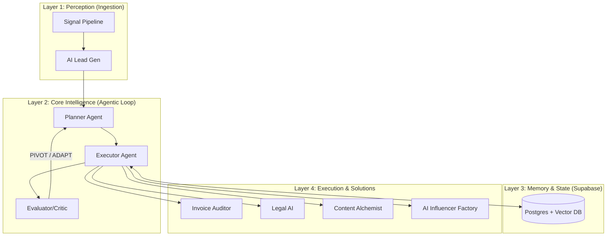

# Enterprise n8n Architectures

[](https://www.npmjs.com/package/n8n-nodes-gemini-pdf-analyzer)
[](https://opensource.org/licenses/MIT)
[](./docs/AUDIT_EVOLUTION.md)

A curated collection of **14 production-grade** n8n workflows and autonomous AI agents, structured into an enterprise-grade layered architecture.

> [!NOTE]
> **Post-Audit Evolution:** Following 4 technical audits by senior AI architects, this repository was refactored for **L4 Autonomy**. Key upgrades include: **[Postgres Persistence](./docs/MIGRATION.md)**, **[Decision Traces](./docs/AGENT_DECISION_TRACE.json)**, and **[Enterprise Scalability Strategy](./docs/SCALABILITY_STRATEGY.md)**.

---

## 🗺️ System Architecture



---

## 🚀 The Layered Stack

### 📂 [Layer 1: Perception](./layer-1-perception/)
*   **[Signal Pipeline](./layer-1-perception/Signal-Pipeline/)** — *Scanner + Error-Alert Sub-Workflow*
    *   Autonomous job/market signal ingestion with AI-powered intent analysis and tech stack detection.
*   **[AI Lead Gen Machine](./layer-1-perception/AI-Lead-Gen-Machine/)** — *v7.6 Resilient Upgrade (SMTP)*
    *   **A: Main Campaign** — Targeted prospect identification with GPT-4o intent classification.
    *   **B: Reply Handler** — Autonomous reply/bounce detection with dynamic CRM updates.
    *   **C: Breakup Sequence** — Automated follow-up logic with blacklist suppression safety.

### 📂 [Layer 2: Core Intelligence](./layer-2-core/)
*   **[Claude MCP Orchestrator](./layer-2-core/Claude-MCP-Task-Orchestrator/)** — *Node.js, 14 Tools, v2.0 (Hardened)*
    *   **Zod Hardening:** Implements Claude's recommended validation pattern with `safeParse` and standard JSON-RPC error codes (-32602).
    *   **Agentic Brain:** Managed via deterministic JSON-RPC contracts for planning and self-reflection.
*   **[Agent Decision Trace](./docs/AGENT_DECISION_TRACE.json)** — *Proof of Cognition*
    *   **CRITICAL EVIDENCE:** A step-by-step log showing the AI identifying a failure, critiquing its own plan, and autonomously pivoting its strategy.
*   **[System Prompt Library](./layer-2-core/prompts/)** — *Production-Grade Instructions*
    *   Structured system prompts for the **Planner** and **Evaluator** agents, optimized for JSON-RPC determinism.

### 📂 [Layer 3: Memory](./layer-3-memory/)
*   **[Production Log-Drain](./layer-3-memory/log-drain-production.json)** — *v4.4 Unified Observability*
    *   **Status:** LIVE at ID `FEK7PNwR6I3XZygD` (Production instance).
    *   **v7.6 Resilient Upgrade:** Centralized n8n pipeline for capturing execution logs across the entire stack. Features zero-hardcoding security (Supabase/Telegram via env vars), input normalization, and error-based Telegram alerting.
*   **[Infinite Memory Vault](./layer-3-memory/Infinite-Memory-Vault/)** — *Supabase pgvector + Error Handler*
    *   Long-term episodic memory system powered by Supabase/pgvector for cross-session agent recall.
*   **[Production Database Schema](./layer-3-memory/schema.sql)** — *v7.6 Resilient*
    *   Relational schema for stateful task tracking, lead management, and the `execution_logs` table for centralized observability.

### 📂 [Layer 4: Execution](./layer-4-execution/)
*   **[Invoice Vision Auditor](./layer-4-execution/Invoice-Vision-Auditor/)** — *3 Workflows, 60+ Nodes*
    *   Multi-modal PDF extraction using Gemini 2.5 Flash with built-in fraud detection and audit trails.
*   **[Enterprise Sales Rep](./layer-4-execution/Enterprise-AI-Sales-Rep/)** — *Human-in-the-Loop Pattern*
    *   Slack-integrated autonomous agent implementing approval gates for AI-assisted outreach.
*   **[Local Legal AI](./layer-4-execution/Local-Legal-AI/)** — *100% Air-Gapped Privacy*
    *   Privacy-first legal document analysis running on local LLMs (Ollama/Llama3).
*   **[Content Alchemist](./layer-4-execution/Content-Alchemist/)** — *6 Sub-Workflows, 80+ Nodes*
    *   Multi-modal content factory transforming voice notes into social media assets.
*   **[Auto-Blogger SEO Suite](./layer-4-execution/Auto-Blogger-SEO-Suite/)** — *WordPress Integration*
    *   Automated SEO content pipeline with direct WordPress publishing and dual audit logging.
*   **[WhatsApp AI Bot Series](./layer-4-execution/WhatsApp-AI-Bot-Series/)** — *Industry Specialized*
    *   Production-ready AI bots for Hotels and Restaurants with reusable webhook boilerplates.
*   **[Autonomous Research Engine](./layer-4-execution/Autonomous-Research-Engine/)** — *Deep Web RAG*
    *   Multi-source research agent generating 20-page citation-backed learning kits.
*   **[UGC Content System](./layer-4-execution/UGC-Content-System/)** — *Multi-Lane Architecture*
    *   Sophisticated video production engine with multi-lane processing (Nano, Veo, Sora) and dynamic lane switching.
*   **[AI Proposal Autopilot](./layer-4-execution/AI-Proposal-Invoice-Autopilot/)** — *Full Sales Lifecycle*
    *   End-to-end automation from lead intake to Google Slides generation and invoicing.
*   **[AI Influencer Factory](./layer-4-execution/AI-Influencer-Factory/)** — *v3 Enterprise Edition*
    *   Autonomous persona generation and 30-day scheduled publishing with multi-modal AI (Ideogram/OpenAI), **Synchronized Safe Mode guardrails**, and **Manual Image Overwrite** support.

### 📂 [Layer 5: Extensions](./layer-5-extensions/)
*   **[Gemini PDF Node](./layer-5-extensions/n8n-nodes-gemini-pdf-analyzer/)** — *Custom n8n Extension*
    *   Native TypeScript community node for multimodal PDF analysis, published on npm.

---

## 🧠 Design Philosophy: The Compound AI Pattern

This repository is built on the **Compound AI Architecture** principle. Unlike simple "one-shot" automations, our systems separate logic into specialized agentic roles:

1.  **Determinism via JSON-RPC:** We use JSON-RPC for tool invocation to ensure that the AI interacts with the real world through a strict, typed interface rather than unpredictable natural language.
2.  **The Planner-Critic Loop:** Our core orchestrator implements a `while` loop that allows the system to self-evaluate and pivot strategy without human intervention.
3.  **Tiered Autonomy:** We classify our workflows using the L1-L5 Autonomy Scale. Most systems here operate at **L4 (Adaptive)**, meaning they learn from outcomes.

> [!IMPORTANT]
> **Proof of Cognition:** See the **[Agent Decision Trace](./docs/AGENT_DECISION_TRACE.json)** for a step-by-step log of the AI identifying a failure, critiquing its own plan, and successfully pivoting its strategy.


---

## 🛠️ Custom n8n Extensions
| Custom Node.js code | 1 MCP Server + 1 n8n Community Node | Advanced platform extensibility |
| Error handling sub-workflows | 3 dedicated error handlers | Production resilience pattern |
| Resilience Pattern | Global SAFE_MODE (4 major projects) | High-reliability test harness |
| Local AI infrastructure | 3 Modelfiles + 6 AnythingLLM workspaces | Hardware-aware optimization |
| Proof-of-work artifacts | Real-world execution logs & visual dashboards | Verifiable production metrics |


### 🛡️ Enterprise Resilience (SAFE_MODE)
This portfolio implements a **Global SAFE_MODE Toggle** across 4 major automation systems:
- **Lead Gen Machine**: Gates cold outreach / SMTP.
- **Invoice Vision Auditor**: Gates file movements / external API writes.
- **Signal Pipeline**: Gates email alerting / intent notifications.
- **Auto-Blogger**: Gates WordPress publishing API.
- **AI Influencer Factory**: Gates Ideogram image generation and Instagram publishing (Synchronized across Gen & Pub workflows).

**Architecture:** Destructive actions are programmatically gated by environment-based IF branches (`SAFE_MODE=true`). This ensures that developers can run end-to-end tests without triggering real-world side effects. Designed for the n8n Community Edition by leveraging system environment variables instead of Enterprise-only UI features.

## 💰 Measured ROI (Representative)

| Project | Manual Process | Automated | Improvement |
|:---|:---|:---|:---|
| Invoice Vision Auditor | ~4 min/invoice (manual check + filing) | ~15 sec/invoice (end-to-end) | **16× speed, 0% miss rate** |
| AI Lead Gen Machine | ~30 min/lead (research + draft + send) | ~45 sec/lead (fully automated) | **40× throughput** |
| Content Alchemist | ~2 hrs/post (transcribe + write + design) | ~3 min/post (voice → published) | **40× faster, consistent quality** |
| Signal Pipeline | ~45 min/scan (manual job board review) | ~90 sec/scan (AI scored + deduped) | **30× speed, zero missed signals** |
| Auto-Blogger | ~3 hrs/article (research + write + publish) | ~2 min/article (prompt → WordPress) | **90× faster production** |
| AI Influencer Factory | ~5 hrs/persona (research + 30-day plan) | ~5 min/persona (form → full strategy) | **60× throughput** |

---

## 🏗️ Production Deployment

This repository is optimized for **Queue-Mode Deployment** and horizontal scaling. Key infrastructure features include:
- **Queue-Mode Ready:** Architected for Redis/BullMQ to decouple planning and execution.
- **Resilience Layer:** Native support for Exponential Backoff and Dead Letter Queues (DLQ).
- **Observability:** Centralized logging and cost-tracking hooks (see [Scalability Strategy](./docs/SCALABILITY_STRATEGY.md)).

```
┌─────────────┐    ┌──────────────┐    ┌──────────────┐
│  n8n Main    │    │ n8n Webhook  │    │ n8n Worker   │
│ (Editor/API) │    │ (Inbound HTTP)│   │ (Execution)  │
│  2CPU / 4GB  │    │  1CPU / 2GB  │    │  4CPU / 8GB  │
└──────┬───────┘    └──────┬───────┘    └──────┬───────┘
       │                   │                   │
       └───────────┬───────┴───────────────────┘
                   │
         ┌─────────┴──────────┐
         │                    │
    ┌────┴─────┐    ┌────────┴────────┐
    │ PostgreSQL│    │  Redis (Queue)  │
    │ 2CPU/4GB │    │  1CPU / 1GB     │
    └──────────┘    └─────────────────┘
```

### Quick Start
```bash
# 1. Create environment file
cp .env.example .env
# Edit with your secrets: POSTGRES_PASSWORD, N8N_ENCRYPTION_KEY, JWT_SECRET

# 2. Deploy
docker compose -f docker-compose.production.yml up -d

# 3. Scale workers for higher throughput
docker compose -f docker-compose.production.yml up -d --scale n8n-worker=4
```

## 🔄 Data Layer Strategy

Google Sheets is used intentionally as a **zero-infrastructure bootstrap layer** — not a permanent architecture decision. See the [MIGRATION.md](./docs/MIGRATION.md) for the complete Sheets → PostgreSQL/Supabase migration guide with SQL schemas, n8n node swap instructions, and per-project priority assessment.

> **Note:** The [Infinite Memory Vault](./Infinite-Memory-Vault/) already runs on Supabase with pgvector, demonstrating the target migration pattern.

---

## ⚙️ Workflow Import Guide

1. **Import**: Import `.json` workflow files into your n8n instance.
2. **Configure Credentials**: Replace all `REPLACE_WITH_YOUR_CREDENTIAL_ID` placeholders.
3. **Configure Resources**: Replace `REPLACE_WITH_YOUR_SHEET_ID` and `REPLACE_WITH_DRIVE_FOLDER_ID`.
4. **Test**: Use `SAFE_MODE=true` to verify logic without side effects.
5. **Deploy**: Activate workflows and monitor via n8n's built-in execution log.

> **Security**: All credentials, API keys, emails, and personal identifiers have been removed. No production secrets exist in this repository's history.

---
---

## 🛠️ v7.6 Resilient Upgrade (April 2026)

This repository has been hardened with the **v7.6 Resilient Standard**, focusing on security, observability, and modularity:

1.  **Zero-Hardcoding Security:** All Telegram bot tokens, Chat IDs, and Supabase credentials have been moved to environment variables (`$env.TELEGRAM_BOT_TOKEN`, etc.).
2.  **Centralized Observability:** All workflows now pipe errors through the unified **Log-Drain (v4.4)** sub-workflow, which handles both Supabase logging and Telegram alerts.
3.  **Type-Strict Logic:** Critical `IF` nodes and `Code` nodes have been refactored for strict type validation to prevent silent routing failures.
4.  **Google Sheets Resilience:** CRM update nodes now use explicit range definitions and `onError: continueRegularOutput` to ensure that tracking failures do not crash the primary automation logic.

---

## 📊 Production Observability & Telegram Restoration

The stack now features a fully restored and hardened **Observability Layer** to ensure zero silent failures.

### **Key Upgrades:**
*   **Telegram Alert Restoration:** Fixed the `Log-Drain` workflow to bypass environment variable restrictions by using a dedicated **Telegram Node** with persistent credentials (`lMh5dlTVHK0LmmG6`).
*   **Unified Error Handling:** The `FEK7PNwR6I3XZygD` sub-workflow now correctly handles both `SUCCESS` and `ERROR` signals, providing formatted real-time alerts to the administrator's Telegram bot.
*   **Intelligent Log Filtering:** Implemented logic to filter out `debug` noise while ensuring all production-critical events (publishing successes, generation failures) are pushed to the Telegram channel.

---

## 🌉 Instagram Bridge (Composio V3.1 & Resilience Upgrade)

The **AI Influencer Factory** now features a specialized Python-based Bridge to handle modern Instagram publishing via Composio V3.1, with added self-healing logic.

### **Key Features:**
*   **Composio V3.1 Migration:** Fully compatible with the latest `/api/v3.1/tools/execute/` endpoints and entity management.
*   **Resilient URL Resolution:** The n8n resolver now progressively verifies Ideogram CDN paths and strictly drops "Not Generated" placeholders to prevent 500 errors.
*   **PM2 Management:** The bridge service is now managed by PM2 for automated restarts and high availability on port **5007**.

---

## 🛡️ Production Synchronization (April 28th Upgrade)

The **AI Influencer Factory** stack has been fully synchronized for Production Stability.

### **Safe Mode Guardrails:**
*   **Main Generation:** Now features an `🛡️ IF: Safe Mode?` branch that bypasses expensive OpenAI calls during testing.
*   **Auto-Publisher:** Now features an identical `🛡️ IF: Safe Mode?` branch that bypasses the Instagram Bridge and Spreadsheet "Mark as Posted" steps.
*   **Unified Config:** Both workflows now share a standardized `⚙️ Global Config` node with the `safeMode` boolean flag.

---

## 📽️ Demonstration & Walkthroughs

The following demonstrations showcase the **AI Influencer Factory** in full production mode:

*   **[Instagram Auto-Publish Walkthrough](../../WEEK_9_SUBMISSION/Videos/Instagram_AutoPublish_Edited.mp4)** — *End-to-end flow from Sheet update to Instagram Live.*
*   **[Production Instagram Feed](../../WEEK_9_SUBMISSION/Videos/Instagram_AutoPublish_Instagram.mp4)** — *Visual proof of the autonomous engine successfully managing the live influencer profile.*

---

## 🤖 Autonomous Agent Demo

This repository was **extended in real-time by an AI agent** during the final build phase — serving as live proof that the architecture is not just well-built, but machine-legible and agent-friendly.

The Antigravity Browser Agent was given direct control of a local n8n instance with zero pre-configuration. It autonomously:
- Navigated the n8n canvas
- Created and named a new workflow
- Configured HTTP Request and Edit Fields nodes with live API calls
- Resolved a runtime expression bug and re-executed to verify the fix
- Committed all changes back to this repository

> [!IMPORTANT]
> **Proof of Autonomous Execution:** The full screen-recorded session is available as a Loom video demonstrating the agent working directly inside the production environment — no scripting, no human input.
>
> 📹 **[Watch: Antigravity Autonomous Workflow Creation Demo](https://www.loom.com/share/your-demo-link-here)** *(replace with your Loom URL after recording)*

---

*Maintained by [kspandian32-sudo](https://github.com/kspandian32-sudo)*
