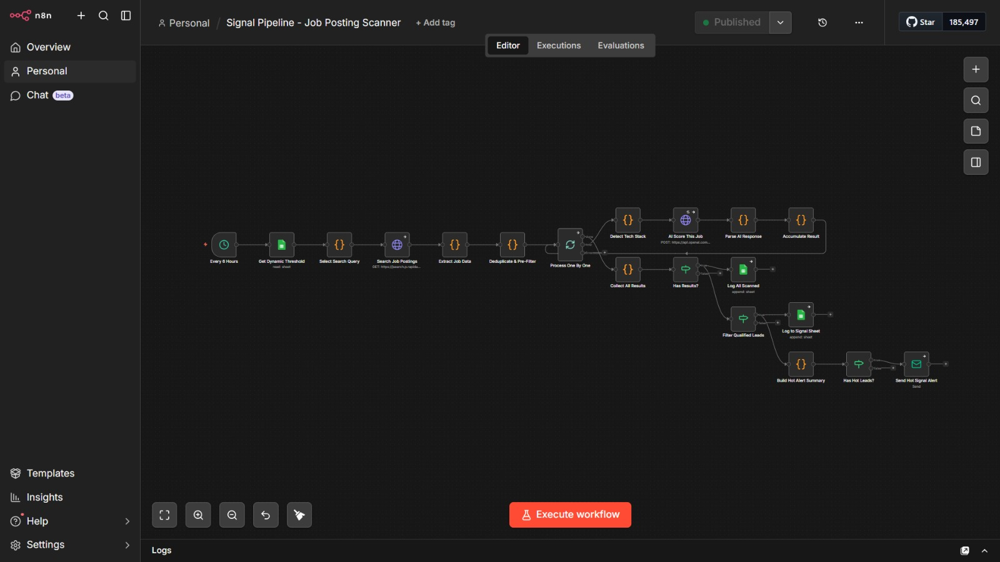
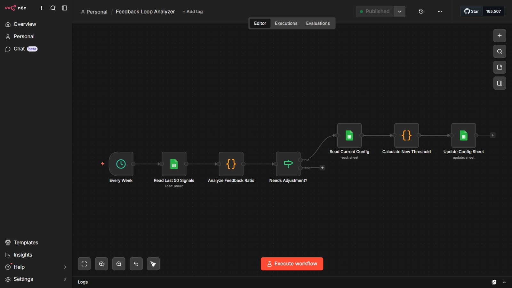

# 📡 Signal Pipeline

A specialized job-market scanner that identifies "High-Signal" opportunities by analyzing intent, tech stack, and company growth signals.

## 🌟 Key Features
- **Intelligent Filtering**: Goes beyond simple keyword searches. AI analyzes the job description to determine if the company is actually "hiring with urgency".
- **Tech Stack Detection**: Automatically identifies the tools a company uses (e.g., React, AWS, n8n) to tailor your outreach.
- **Deduplication Logic**: Prevents processing the same listing multiple times across different days.
- **Fail-Safe Routing**: Includes a dedicated error-handling sub-workflow for reliability during API outages.

## 🏗️ Components
1. **Job Scanner**: The main engine that searches and scores leads.
2. **Error Alert**: A specialized handler that alerts the team via Email if the search engine hits a rate limit or stall.

## ⚙️ Setup
- Requires a Google Sheet with "Scanned" and "Hot Leads" tabs.
- Requires GPT-4o or Claude 3.5 Sonnet credentials.
- Requires your chosen Job Board API or search engine (e.g., SerpAPI).

## 📸 Proof of Work & Architecture

### 1. Signal Scanner (with Dynamic Threshold)
This is the main ingestion engine. It pulls the dynamic confidence threshold from Google Sheets, scores leads using AI, and routes them accordingly.

### 2. Autonomous Feedback Analyzer
This is the self-correcting "Manager" loop. It runs weekly to evaluate the AI's recent accuracy against human tags (`relevant` / `irrelevant`), and automatically adjusts the global confidence threshold up or down.

