# 🏥 AI Client Onboarding Machine — Setup & Deployment Guide

## Prerequisites

| Component | Required | Notes |
|-----------|----------|-------|
| n8n | v2.50.0+ | Self-hosted (Docker or npm) |
| Google Account | OAuth2 | For Sheets + Gmail access |
| Google Gemini API Key | Free tier works | For AI plan generation |
| Google Sheet | "Onboarding Clients" | 4-tab structure |

---

## Step 1: Google Sheets Setup

### Create the "Onboarding Clients" Google Sheet

Create a Google Sheet with **4 tabs**:

#### Tab 1: `Services` (GID: 301191123)
Populate with all 8 service records. Column headers:
```
Service ID | Service Name | Description | Deliverables | SOP Steps | Default Timeline | Tools Used | Price Range (INR) | Prerequisites From Client
```
- **Deliverables** and **SOP Steps** use `|` (pipe) as delimiter
- **Tools Used** and **Prerequisites** use ` and ` as delimiter
- Import from `Onboarding Clients - Services.csv`

#### Tab 2: `Summary` (GID: 894584650)
Column headers:
```
clientName | clientCompany | clientEmail | serviceRequired | clientRequirements | budget | agencyName | yourName | yourEmail | startDate | timestamp | service | plan
```
- `service` and `plan` columns store serialized JSON objects
- Auto-populated by the workflow

#### Tab 3: `Client_Projects_Tab` (GID: 423957115)
Column headers:
```
Client | Company | Email | Service | Deliverable | Description | Week | Owner | Status | Client Approval | Notes | Onboarded At
```
- One row per deliverable per client
- Auto-populated by the workflow

#### Tab 4: `Communications` (for Flow C logging)
Column headers:
```
Date | Client | Type | Week # | Subject | Sent To | Status
```

### Record the Sheet IDs
After creation, note:
- **Document ID**: Found in the Google Sheets URL (`/d/{DOCUMENT_ID}/edit`)
- **Tab GIDs**: Found in each tab's URL (`#gid={GID}`)

---

## Step 2: n8n Credential Setup

### 2.1 Google Sheets OAuth2
1. Go to n8n → Credentials → New Credential → Google Sheets OAuth2 API
2. Follow the OAuth2 flow to connect your Google Account
3. Note the credential ID (used by 7 Google Sheets nodes)

### 2.2 Gmail OAuth2
1. Go to n8n → Credentials → New Credential → Gmail OAuth2 API
2. Connect the same Google Account
3. Note the credential ID (used by 4 Gmail nodes)

### 2.3 Gemini API Key (HTTP Query Auth)
1. Get a free API key from [Google AI Studio](https://aistudio.google.com/apikey)
2. Go to n8n → Credentials → New Credential → Query Auth
3. Set: Name = `key`, Value = `your-gemini-api-key`
4. Note the credential ID (used by 3 HTTP Request nodes)

---

## Step 3: Deploy Workflow

### Option A: Import via n8n UI
1. Open n8n dashboard
2. Click "Add Workflow" → "Import from file"
3. Select `🏥 AI Client Onboarding.json`
4. All 26 nodes will appear in the canvas

### Option B: Deploy via API (Automated)
```bash
python deploy_to_n8n.py
```
This script reads the JSON, filters settings, and creates the workflow via the n8n REST API.

### Option C: Deploy via n8n-mcp (Claude Desktop)
If using Claude Desktop with n8n-mcp integration, the workflow can be deployed programmatically.

---

## Step 4: Configure Node Credentials

After import, update credentials on each node:

| Node Group | Credential Type | Count |
|------------|----------------|-------|
| Google Sheets nodes | Google Sheets OAuth2 | 7 nodes |
| Gmail nodes | Gmail OAuth2 | 4 nodes |
| HTTP Request (Gemini) nodes | Query Auth | 3 nodes |

### Placeholder Replacements

Two nodes in Flow B and Flow C contain placeholder values that must be updated:

| Node | Field | Placeholder | Replace With |
|------|-------|-------------|--------------|
| 📥 Fetch All Active Clients | documentId | `REPLACE_ONBOARDING_SHEET_ID` | Your Google Sheet Document ID |
| 📝 Log to Communications | documentId | `REPLACE_ONBOARDING_SHEET_ID` | Your Google Sheet Document ID |
| 📝 Log to Communications | sheetName value | `REPLACE_COMMUNICATIONS_TAB_GID` | Your Communications tab GID |

---

## Step 5: Test

### Flow A — Primary Onboarding
1. Click "Execute Workflow" in n8n
2. Fill out the form with test data:
   - Client Full Name: `Test User`
   - Client Company Name: `TestCorp`
   - Client Email: `your-email@domain.com`
   - Service Required: `AI Chatbot Setup`
   - Client Specific Requirements: `Need a chatbot for our website`
   - Agreed Budget (INR): `40000`
   - Your Agency Name: `LanceMart AI`
   - Your Name: `Developer`
   - Your Email: `your-email@domain.com`
3. Verify:
   - ✅ Summary tab has a new row with serialized service + plan
   - ✅ Client_Projects_Tab has 10 new deliverable rows
   - ✅ Client received premium HTML onboarding email
   - ✅ Agency received internal copy email

### Flow B — Kickoff Follow-Up
- Triggers daily at 10 AM
- To test immediately: manually execute the `⏰ Daily 10 AM` trigger
- Will only fire if clients have been onboarded 2+ days ago

### Flow C — Weekly Check-In
- Triggers every Monday
- To test immediately: manually execute the `⏰ Every Monday` trigger
- Requires active clients in the CRM

---

## Step 6: Activate

Once tested:
1. Toggle the workflow to **Active** in n8n
2. Flow B and Flow C schedule triggers will now fire automatically

---

## Architecture Diagram

```mermaid
graph TD
    subgraph "Flow A: Primary Onboarding"
        A1["📋 New Client Form<br/>9 fields"] --> A2["🔧 Parse Client Details"]
        A2 --> A3["📥 Read Service from Database<br/>Google Sheets lookup"]
        A3 --> A4["🔀 Merge Client + Service Data"]
        A4 --> A5["🤖 Gemini 2.5 Flash<br/>Build Project Plan from SOPs"]
        A5 --> A6["🔀 Parse Project Plan<br/>with DB fallback"]
        A6 --> A7["📊 Log Client Summary"]
        A6 --> A8["📊 Expand Deliverables"]
        A6 --> A9["📝 Build HTML Client Email<br/>10 visual sections"]
        A8 --> A10["📝 Log Deliverables Tracker"]
        A9 --> A11["📧 Send to Client"]
        A11 --> A12["📧 Send Agency Copy"]
    end

    subgraph "Flow B: Daily Follow-Up"
        B1["⏰ Daily 10 AM"] --> B2["📥 Fetch Welcome Sent Clients"]
        B2 --> B3["🔍 Filter: 2+ Days"]
        B3 --> B4["🤖 Gemini 2.0 Flash<br/>Write Follow-Up"]
        B4 --> B5["📧 Send Kickoff Reminder"]
        B5 --> B6["📝 Update CRM Status"]
    end

    subgraph "Flow C: Weekly Check-In"
        C1["⏰ Every Monday"] --> C2["📥 Fetch Active Clients"]
        C2 --> C3["🔢 Calculate Week Number"]
        C3 --> C4["🤖 Gemini 2.0 Flash<br/>Write Check-In"]
        C4 --> C5["📧 Send Weekly Check-In"]
        C5 --> C6["📝 Log Communication"]
    end

    style A1 fill:#f97316,color:#fff
    style A5 fill:#2563eb,color:#fff
    style A9 fill:#8b5cf6,color:#fff
    style B1 fill:#22c55e,color:#fff
    style C1 fill:#0d9488,color:#fff
```



---

## Troubleshooting

| Issue | Cause | Fix |
|-------|-------|-----|
| Gemini returns error | API key invalid or quota exceeded | Check Query Auth credential; verify key at Google AI Studio |
| Google Sheets 403 | OAuth2 scope missing | Re-authorize Google Sheets credential with full spreadsheet scope |
| Gmail send fails | OAuth2 expired | Re-authorize Gmail credential |
| No follow-up emails | Filter time check | Ensure test client was onboarded 2+ days ago |
| Empty deliverables | AI parse failure | Check fallback logic in 🔀 Parse Project Plan node |
| Placeholder errors | Sheet IDs not replaced | Update REPLACE_ONBOARDING_SHEET_ID in Flow B/C nodes |

---

## Production Hardening Checklist

- [ ] Replace hardcoded email `admin@reoclaw.com` with environment variable
- [ ] Add Error Trigger workflow for admin alerting
- [ ] Implement Safe Mode gate before email send nodes
- [ ] Connect to centralized Log-Drain (ID: `FEK7PNwR6I3XZygD`)
- [ ] Migrate Google Sheets CRM to Supabase/PostgreSQL for enterprise scale
- [ ] Add approval gate for high-ticket services (SRV-008: Full AI Transformation)
- [ ] Add Gmail reply detection for automatic status updates
- [ ] Add Telegram notification for real-time agency alerting

---

*Setup Guide v1.0 • The AI Client Onboarding Machine • Week 10 Submission*
