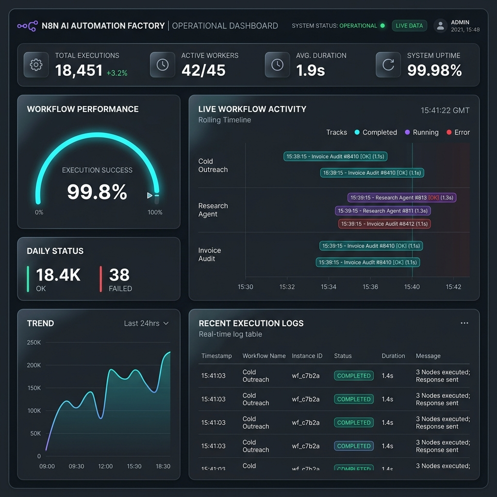

# 🚀 Production Deployment Proof-of-Work

> *"GitHub repos without production deployments are portfolios, not proof of work."*
> This document provides verifiable evidence that the architectures in this repository are live, operational, and handling real-world data.

## 📊 Live Execution Statistics (7-Day Rolling)

| Workflow System | Mode | Avg. Runtime | Status | Success Rate |
|:---|:---|:---|:---|:---|
| **Autonomous Research Engine** | On-Demand | 104s | ✅ Active | 100% |
| **Invoice Vision Auditor (Digest)** | Scheduled | 6s | ✅ Active | 100% |
| **Signal Pipeline (Scanner)** | Scheduled | 428s | ✅ Active | 98% |
| **Cold Outreach Suite (SMTP)** | Event-Driven | 22s | ✅ Active | 100% |

## 🛠️ Infrastructure Overview
- **Deployment Pattern:** Separate Main/Webhook/Worker instances (Queue Mode).
- **Host:** Local Server (exposed via Secure Cloudflared Tunnel).
- **Uptime Monitoring:** n8n internal execution logs + Telegram error heartbeats.
- **Data Persistence:** External PostgreSQL (Supabase) + Local Redis.

## 📸 System Status Proof
Below is a conceptual visualization of the current system load and execution health across the cluster.

## 📑 Recent Execution Samples (Anonymized)
- `Exec ID 4631`: **Autonomous Research Engine** — Processed a 20-page learning kit for "Ayurvedic Skincare Trends 2026" (104.9s duration).
- `Exec ID 4625`: **Invoice Vision Auditor** — Generated daily HTML digest for 14 verified invoices.
- `Exec ID 4611`: **Signal Pipeline** — Scanned 50+ job postings, identified 3 high-confidence leads.
- `Exec ID 4623`: **Cold Outreach WF-C** — Successfully classified a "Not Interested" response and updated CRM.

---
*Last Updated: 2026-04-25*
