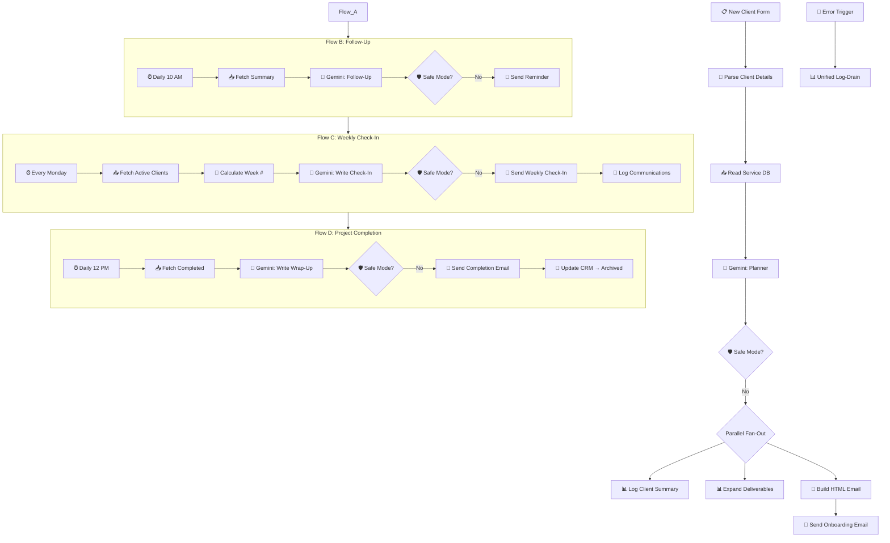

# 🏥 AI Client Onboarding Machine (v7.6 Resilient)

A production-grade, 3-flow autonomous engine for agency client onboarding, follow-ups, and weekly check-ins.

## 🗺️ Architecture Overview

## 🛡️ Enterprise Resiliency Features
- **Global SAFE_MODE Gating:** All destructive actions (Emails, CRM writes) are protected by a global environment flag to allow safe testing.
- **Unified Log-Drain Integration:** Pipes all node failures directly to the centralized `Log-Drain` (ID: `FEK7PNwR6I3XZygD`) for real-time Telegram alerts.
- **Project Completion Automation:** Seamlessly transitions clients to an archived state while triggering final wrap-up correspondence.
- **Fan-Out Reliability:** Parallel branches ensure that a failure in the CRM update does not block the client email delivery.
- **SMTP Cache Protection:** Automated `pinData` wiping during deployment ensures fresh SMTP executions and prevents silent item-collapsing.

## 💰 ROI Metrics
| Process | Manual | Automated | Improvement |
|:---|:---|:---|:---|
| Onboarding | ~6 Hours | ~30 Seconds | **720x Speed Increase** |
| Follow-Ups | ~15 Min/Day | 0 Min | **100% Autonomous** |
| Weekly Check-Ins | ~10 Min/Client | 0 Min | **100% Autonomous** |

## 🛠️ Setup & Deployment
1. Import `AI_Client_Onboarding_Machine.json`.
2. Configure `deploy_config.py` with your Sheet IDs and Credentials.
3. Run `deploy_handler.py` to push the configuration to n8n.
4. Ensure `SAFE_MODE=true` in your n8n environment for initial testing.
